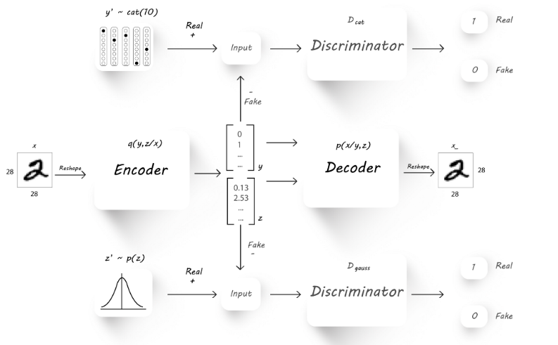

Non Parametric Classification with Advesarial AutoEncoders
============
**PyTorch implementation of Non-parametric Unsupervised Classification with Adversarial Autoencoders.**

Shahar Azulay

|Python27|_ |Python35|_ |License|_ |PyTorch|_ 

|Documentation|_

.. |PyTorch| image:: https://github.com/pytorch/pytorch/blob/master/docs/source/_static/img/pytorch-logo-flame.svg
.. _PyTorch: https://pytorch.org/

.. |License| image:: https://img.shields.io/badge/license-BSD--3--Clause-brightgreen.svg
.. _License: https://github.com/shaharazulay/traceable-dict/blob/master/LICENSE
    
.. |Python27| image:: https://img.shields.io/badge/python-2.7-blue.svg
.. _Python27:

.. |Python35| image:: https://img.shields.io/badge/python-3.5-blue.svg
.. _Python35:
    

.. _Documentation: https://adversarial-autoencoder-classif.readthedocs.io/en/latest/

*[1] A.Makhzani,  J.Shlens, N.Jaitly, I.Goodfellow, B.Frey: Adversarial Autoencoders, 2016, arXiv:1511.05644v2*

**Usage Examples:**

  Install the module
   
        >>> python setup.py install --user
        
  Initializing the Datasets
        
        >>> init_datasets --dir-path <path-to-data-dir>

  Train a new AAE in an Semi-Supervised setting
  
        >>> train_semi_supervised --dir-path <path-to-data-dir> --n-epochs 35 --z-size 2 --n-classes 10 --batch-size 100
        loading data started...
        dataset size in use: 3000 [labeled trainset]  47000 [un-labeled trainset]  10000 [validation]
        using configuration:
         {'learning_rates': {'auto_encoder_lr': 0.0008, 'generator_lr': 0.002, 'discriminator_lr': 0.0002, 'info_lr': 1e-05,             'mode_lr': 0.0008, 'disentanglement_lr': 0}, 'model': {'hidden_size': 3000, 'encoder_dropout': 0.2}, 'training':               {'use_mutual_info': False, 'use_mode_decoder': False, 'use_disentanglement': True, 'use_adam_optimization': True,            'use_adversarial_categorial_weights': True, 'lambda_z_l2_regularization': 0.15}}
        current epoch:: [ ===================  ] 99.79%
        ...
        
  Train a new AAE in a Fully Unsupervised setting

        >>> train_unsupervised --dir-path <path-to-data-dir> --n-epochs 35 --z-size 2 --n-classes 10 --batch-size 100
        loading data started...
        dataset size in use: 3000 [labeled trainset]  47000 [un-labeled trainset]  10000 [validation]
        ...
        
   Visualize a trained model using pre-defined visualizations

        >>> generate_model_visualization --dir-path <path-to-data-dir> --model-dir-path {<path-to-model-dir> --mode unsupervised --n-classes 10 --z-size 5
        loading data started...
        dataset size in use: 3000 [labeled trainset]  47000 [un-labeled trainset]  10000 [validation]
        Label 1: 40.2%, Best matching label; 20
        Label 2: 41.9%, Best matching label; 14
        Label 3: 33.0%, Best matching label; 4
        Label 4: 41.1%, Best matching label; 2
        Label 5: 53.8%, Best matching label; 11
        Label 6: 44.3%, Best matching label; 26
        Label 7: 48.6%, Best matching label; 6
        Label 8: 47.6%, Best matching label; 0
        Label 9: 40.1%, Best matching label; 22
        ACCURACY: 0.85%
        ...
