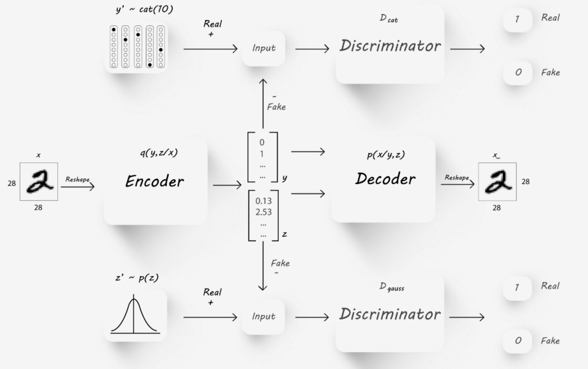

The Model
-----

Adversarial AutoEncoders were first described by [1].

The proposes adversarial autoencoder (AAE) uses the concept of generative adversarial networks
(GAN) to perform variational inference by matching the posterior of the latent encoding vector of the autoencoder with an pre-selected prior distribution.

Matching the distribution of the latent vector into a known prior ensures that meaningful samples can be generated from any
part of prior space.
As a result, the decoder of the AAE learns a deep generative model that maps the imposed prior
to the input data distribution. 
In addition to that, the encoder of the AAE learns to encode any given input image into the given prior.

The design of the AAE makes it usable for applications such as semi-supervised classification, disentangling style and content of the input image.
By selecting the prior distribution of the latent vector to describe a categorial disrtribution (in part), one can use the latent features to classify the input into a set of pre-known labels.

This can be highly effective for more than just dimensionality reduction (which is the common application when it comes to standard AE), and into supervised classification, semi-supervised classification and unsupervised clustering.

As a result in the rest of this manual the latent vector will be divied into two parts: the **latent y** part - aimed for categorical distribution, and the **latent z** part - aimed for normal zero-centered distribution.

The AAE is built from the following parts:

1. **Encoder Network** usually marked with the latter *Q*, encoding the input into the latent space.
2. **Decoder Network** usually marked with the latter *P*, decoding the latent space into an output of dimensions identical to those of the input.
3. **Categorical Descriminator** usally makred as *D_cat*, used to decide if the latent y is categorically distributed.
4. **Gauss Descriminator** usally makred as *D_gauss*, used to decide if the latent z is normally distributed.
5. **Provide a meaningful id** to the revisions - such as a timestamp, or verison number.
6. More....

*[1] tracing the changes in a JSON-like object*

The Training Process
-----

There are many possible solutions to trace the changes in a dict-like object. The major differences between them is the way in which the trace history is stored.

The three main possibilities go back to:

1. **In-Object** solution - where the trace is embedded into the dict-like object itself.
2. **Out-Of-Object** solution - where the trace is stored using some additional attribute of the dict-like object.
3. **Trace by Multiple Objects** solution - where the trace is stored by storing multiple copies of the dict-like object, usually equal to the number of known reivisions.

The use of the Out-Of-Object method is not relevant in cases where the object needs to go through serializaion, such as in cases where the object needs to be stored on disk, in a database or in any other non-Python native and consistent form.
Therefore, we chose to not address this solution as viable.

We chose to focus our solution to work well for non-relational DBs, which store document JSON-like documents natively.
The *Trace by Multiple Objects* solution would force the creation of multiple documents in the DB, possibly resulting in a high memory overhead, if objects are kept in full.

However, such solution would provide quick access time for the latest revision of the document.
A possible upgrade of this solution would be to store diffs between document revisions only, but that would possiblt result in a slower accesss time of the latest version.

.. image:: _static/trace_methods.jpg

*[1] In-Objecr and Multiple Objects methods for tracing the changes in a JSON-like object*

We chose to store the trace *In-Object*. While this method is limited by the max allowed size of the document, and may not be suitable for very large documents, we found it to be the most elegant solution.

The trace is stored as part of the dict-like structure of the document allowing **quick access** to the latest revision, while storing only diffs between revision which results in **lower memory costs**.

Inference
-----

The In-Object trace solution we chose results stores the latest version of the dictionary, and with it two meta-fields that describe the history of the dict-like object:

1. **trace** - capturing diffs between different revisions of the dict over the different revisions.
2. **revision** - capturing the ids of the different revision in which the dict changes.

The space performance is therefore effected directly and linearly by the dict average size, and by the number of revisions, per-key in the dict.

In order to support real world memory restrictions, such as MongoDb maximum document size (16MB), the TraceableDict also support a limited "memory" if needed and can drop old revisions, allowing it to store the latest k-revision only in a cyclic manner.

RunTime Performance
-----

Here are the general asymptotic bounds of expected runtime performance:

1. **as_dict** - Access to the latest dict revision is done in **O(k)**, where k is the number of k
2. **commit** - Assigning a meaningful revision id to all uncommited changes is done in **O(1)**.
3. **revert** - Reverting all uncommited changes is done in **O(1)**.
4. **checkout** - Rolling back to an old revision is done in **O(m + n)** where m is the number of revisions between the working tree and the desired revision, and n is the number of per-key diffs performed between the two revisions.
5. **remove_oldest_revision** - Removing the oldest revision is done in **O(1)**.
6. **log** - Displaying commit logs shows similar performance to *checkout* method.
7. **diff** - Showing changes between revisions shows similar performance to *checkout* method.
