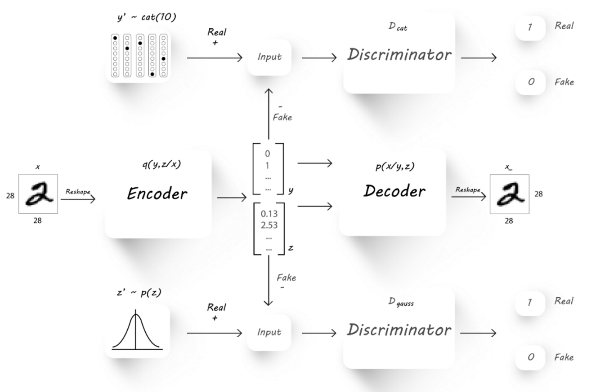

The Model
-----

Adversarial AutoEncoders were first described by [1].

The proposes adversarial autoencoder (AAE) uses the concept of generative adversarial networks
(GAN) to perform variational inference by matching the posterior of the latent encoding vector of the autoencoder with an pre-selected prior distribution.

Matching the distribution of the latent vector into a known prior ensures that meaningful samples can be generated from any
part of prior space.
As a result, the decoder of the AAE learns a deep generative model that maps the imposed prior
to the input data distribution. 
In addition to that, the encoder of the AAE learns to encode any given input image into the given prior.

The design of the AAE makes it usable for applications such as semi-supervised classification, disentangling style and content of the input image.
By selecting the prior distribution of the latent vector to describe a categorial disrtribution (in part), one can use the latent features to classify the input into a set of pre-known labels.

This can be highly effective for more than just dimensionality reduction (which is the common application when it comes to standard AE), and into supervised classification, semi-supervised classification and unsupervised clustering.

As a result in the rest of this manual the latent vector will be divied into two parts: the **latent y** part - aimed for categorical distribution, and the **latent z** part - aimed for normal zero-centered distribution.

The AAE is built from the following parts:

1. **Encoder Network** usually marked with the latter *Q*, encoding the input into the latent space.
2. **Decoder Network** usually marked with the latter *P*, decoding the latent space into an output of dimensions identical to those of the input.
3. **Categorical Descriminator** usally makred as *D_cat*, used to decide if the latent y is categorically distributed.
4. **Gauss Descriminator** usally makred as *D_gauss*, used to decide if the latent z is normally distributed.
5. **Provide a meaningful id** to the revisions - such as a timestamp, or verison number.

The Training Process
-----

The training process combines two major parts:

1. **Reconstruction Loss** which measures the loss between the input and image and the reconstructed output image.
   The reconstruction loss is part the vanilla AE training, forcing the AE to learn meaningful latent encoding as a result of forcing it to create a good reconstruction (past decoding) of the input image.
2. **Advesarial Loss** which is part of the classic advesarial generative training (GAN), and is build from a generator and a descriminator loss.
  In this case, there descriminator loss is the sum of two losses from the categorical and gaussian descriminators, each measuring a different part of the latent vector.
  The generaor here is also the sum of two losses, measuring the ability of the generator (the encoder Q network) to create quailty "fake" latent features which match the expected posterior the descriminators learn to identify.

Inference
-----

Followed the training process, the AAE is in fact a classifier as any other. 
The inference is performed using the decoder alone (Q) and observing the latent y part of the latent features, which can provide the predicted label for a new unseen input image.

.. image:: _static/adversarial_autoencoder_inference.png

This is how the model can tested and validated, using the inference process over a pre-known validation set.

*[1] A.Makhzani,  J.Shlens, N.Jaitly, I.Goodfellow, B.Frey: Adversarial Autoencoders, 2016, arXiv:1511.05644v2*

