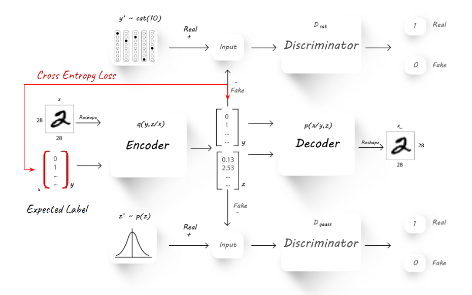
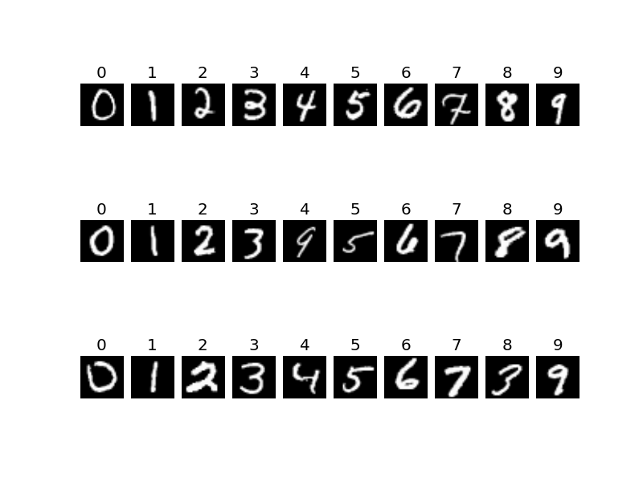
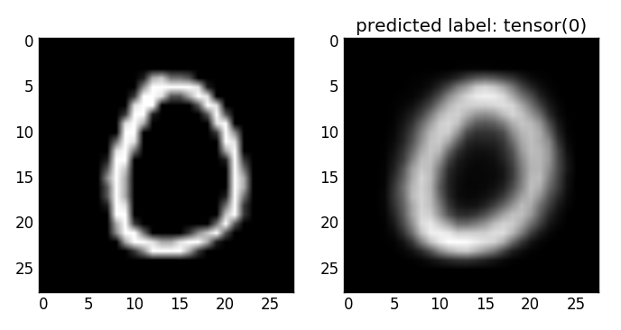
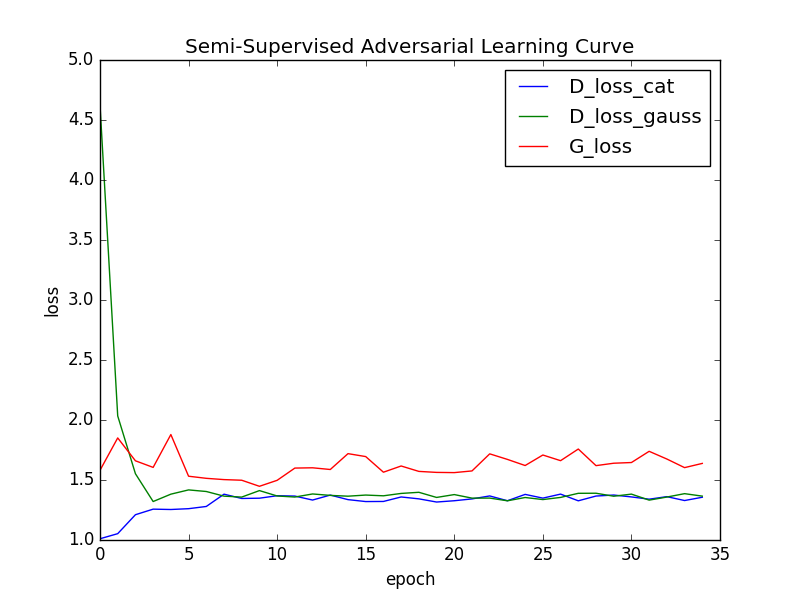

*****
Semi Supervised VAE
*****

General Concept
-----

In the concept described in [1], Variational AE can be submitted to semi-supervised learning.

The adversarial autoencoder contains a simple AE at its center. The model for semi-supervised learning exploits the generative description of the unlabeled data
to improve the classification performance that would be obtained by using only the labeled data.
As in many cases, unlabeled data is more abundant and accessible. Using it as part of the adversarial AE learning, will help the encoding improve, alongside it producing better labeling.

**The general schema can be seen here:**

The basic schema follows the exact implementation of VAE, with the only difference of introducing a labeled image from time to time into the training process.
The labeled image is treated differently and is measured using a new Cross Entropy loss again the known target label.
This loss only effect the Encoder (Q) - causing it to learn how to predict the labled images currectly over the latent y categorical part.

The Training Process
-----

The training process is divided into three major parts:

1. **Auto Encoding (reconstruction)** where the Encoder-Decoder networks (Q, P) learns to encode and reconstruct the image.
2. **Adversarial** where the encoder learns how to produce latent features y which are categorical and z which are normally distirbuted.
3. **Semi-supervised** where the encoder learns to predict the right label for a pre-known labeled image.

The success of the training process can be measured based on two grounds:

**Validation accuracy** on a held out labeled validation set.
The results of the semi-supervised model reached **94% accuracy**, which shows good performance and that the model learns the labeled part properly.

  
  *each column representing a predicted label for the original displayed images, showing the high accuracy of the model*
  
**Visual reconstruction** 
Here we can see from visual examples that the reconstruction of an image (using the encoding-decoding pipeline) works pretty well. The reconstructed image is slightly blurry, which might be corrected with a slightly different loss function.

*an example reconstruction of an original "0" digit image*

In order to analyise the success of the adversarial part (which is focused on the latent features) we can examine the learning curve, showing the loss of the generator, and descriminator networks:

*the adversarial learning curve, showing the balance which is created between generator and discriminators*

The Latent Features
-----

The adverserial training pushes the latent features to the desired distribution. The latent y part learns to behave similarly to a categorial distribution, whlie the latent z part learns to distribute as a zero-centered normal.

.. image:: _static/semi_supervised_latent_features.png

This module implements a traceable Python dictionary, that stores change history in an efficient way inside the object.
It allows the user to:

1. **Trace reverions** of the dictionary's content and structure.
2. **Roll the dictionary back** to previously stored values.
3. **Trace the changes** between its different revisions.
4. **Revert** unwanted changes made.
5. **Provide a meaningful id** to the revisions - such as a timestamp, or verison number.
6. More....

.. image:: _static/diff_example.jpg

*[1] A.Makhzani,  J.Shlens, N.Jaitly, I.Goodfellow, B.Frey: Adversarial Autoencoders, 2016, arXiv:1511.05644v2*

The Solution
-----

There are many possible solutions to trace the changes in a dict-like object. The major differences between them is the way in which the trace history is stored.

The three main possibilities go back to:

1. **In-Object** solution - where the trace is embedded into the dict-like object itself.
2. **Out-Of-Object** solution - where the trace is stored using some additional attribute of the dict-like object.
3. **Trace by Multiple Objects** solution - where the trace is stored by storing multiple copies of the dict-like object, usually equal to the number of known reivisions.

The use of the Out-Of-Object method is not relevant in cases where the object needs to go through serializaion, such as in cases where the object needs to be stored on disk, in a database or in any other non-Python native and consistent form.
Therefore, we chose to not address this solution as viable.

We chose to focus our solution to work well for non-relational DBs, which store document JSON-like documents natively.
The *Trace by Multiple Objects* solution would force the creation of multiple documents in the DB, possibly resulting in a high memory overhead, if objects are kept in full.

However, such solution would provide quick access time for the latest revision of the document.
A possible upgrade of this solution would be to store diffs between document revisions only, but that would possiblt result in a slower accesss time of the latest version.

.. image:: _static/trace_methods.jpg

*[1] In-Objecr and Multiple Objects methods for tracing the changes in a JSON-like object*

We chose to store the trace *In-Object*. While this method is limited by the max allowed size of the document, and may not be suitable for very large documents, we found it to be the most elegant solution.

The trace is stored as part of the dict-like structure of the document allowing **quick access** to the latest revision, while storing only diffs between revision which results in **lower memory costs**.

Memory Performance
-----

The In-Object trace solution we chose results stores the latest version of the dictionary, and with it two meta-fields that describe the history of the dict-like object:

1. **trace** - capturing diffs between different revisions of the dict over the different revisions.
2. **revision** - capturing the ids of the different revision in which the dict changes.

The space performance is therefore effected directly and linearly by the dict average size, and by the number of revisions, per-key in the dict.

In order to support real world memory restrictions, such as MongoDb maximum document size (16MB), the TraceableDict also support a limited "memory" if needed and can drop old revisions, allowing it to store the latest k-revision only in a cyclic manner.

RunTime Performance
-----

Here are the general asymptotic bounds of expected runtime performance:

1. **as_dict** - Access to the latest dict revision is done in **O(k)**, where k is the number of k
2. **commit** - Assigning a meaningful revision id to all uncommited changes is done in **O(1)**.
3. **revert** - Reverting all uncommited changes is done in **O(1)**.
4. **checkout** - Rolling back to an old revision is done in **O(m + n)** where m is the number of revisions between the working tree and the desired revision, and n is the number of per-key diffs performed between the two revisions.
5. **remove_oldest_revision** - Removing the oldest revision is done in **O(1)**.
6. **log** - Displaying commit logs shows similar performance to *checkout* method.
7. **diff** - Showing changes between revisions shows similar performance to *checkout* method.
