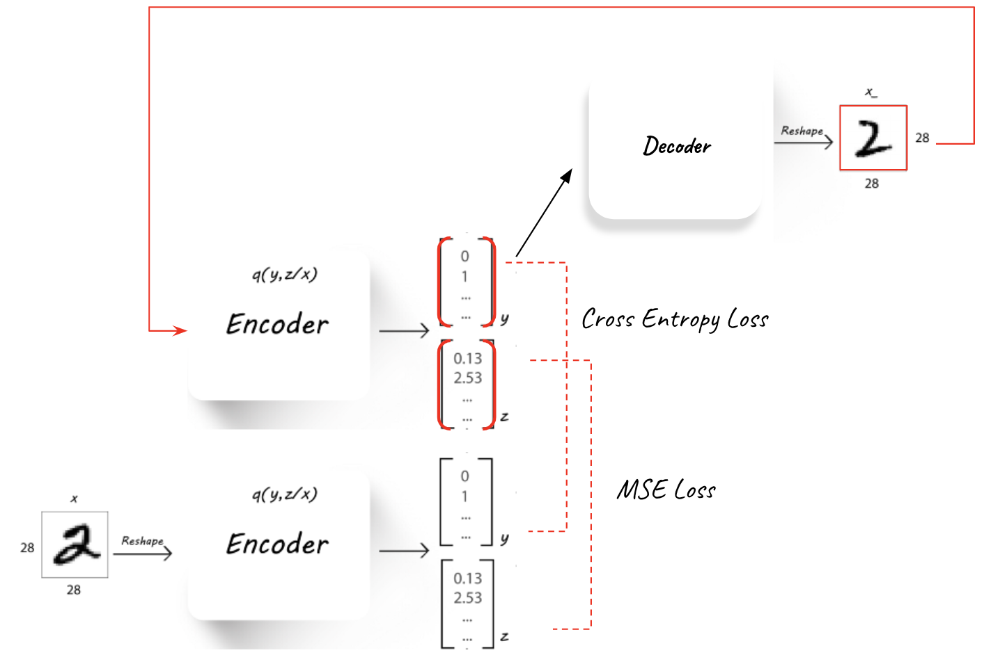
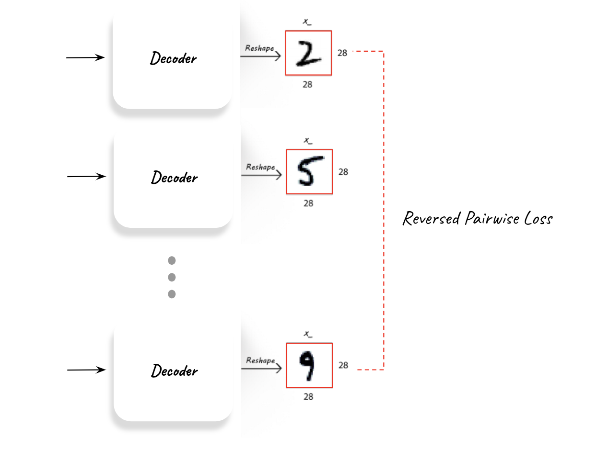
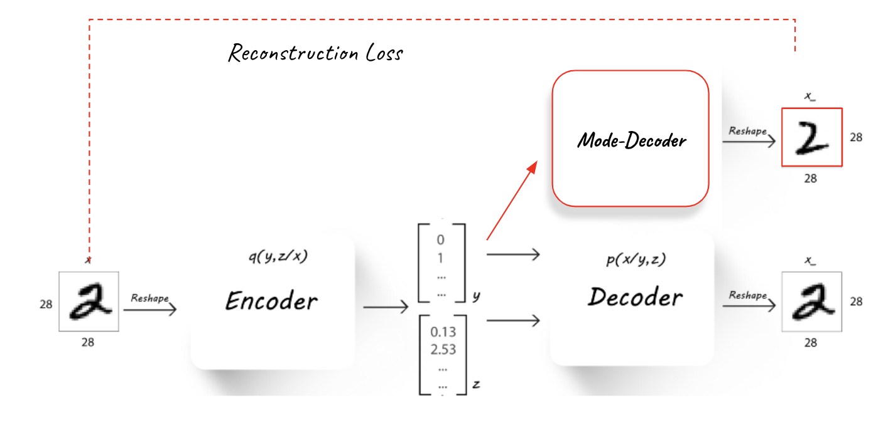

*****
Fully Unsupervised Classification with Advesarial Auto Encoders
*****

General Concept
-----

In the concept described in [1], AAE can be submitted to semi-supervised learning, training them to predict the correct label using their latent feature representation, and based on a semi-supervised training set.

Training the the network in a fully unsupervised manner requires deeper analysis and handling.

In order to create a better disentanglement in the AAE’s latent space the following methods were tested:

1. **Cyclic mode loss**
The use of a cyclic mode loss (Figure 1) - that will measure the mutual information between the latent space after the Encoder and the one after another cycle of Decode-Encoder.
Minimizing this loss should push the Encoder and Decoder to use the latent space in a consistent fashion.
The cyclic loss is implemented in a similar idea to the one suggested in InfoGAN[2].

2. **L2 regularization on latent z**
Limiting the use of the z part of the latent space using L2 loss regularization over z.
Minimizing this loss can assist in pushing more information into the y part when possible, and possibly allow better disentanglement in the latent space.ֿ

3. **Mode reconstruction loss**
Integrating another Decoder (Figure 2) called the Mode-Decoder into the training process, which is trained to learn the “mode” of the image, therefore forcing the Encoder to use the y latent space in a meaningful way.

4. **reversed pairwise mode loss**
To try and improve the style-label mixture inside the generated clusters another method was attempted and it was to integrate reversed pairwise mode loss (Figure 15) - that will push the Decoder to create “modes” which are as far apart from one another as possible.

**The added componenets to the unsupervised training can be seen here:**

Unsupervised classification accuracy metric
-----

Before diving into the unsupervised setting, a metric of accuracy performance needs to be agreed upon.
In the fully unsupervised scenario the model has no input on the real “cultural” labels stored in the validation set.  Meaning it can be a perfect classifier, and label all “0” digits together, all “1” digits together and so on, but label each group under the “wrong” cultural label (for example labeling all “0” digits under the label “8”).

Inspired by a metric commonly used for clustering accuracy, the chosen metric used in the following parts of this paper will be referred to as unsupervised classification accuracy.

The metric was measured after the training of an AAE model (and during for debugging purposes only) and it follows the following logic - 
The trained model was used to predict the labels of the entire validation set.
Each possible output label of the AAE was assigned a true MNIST label using the highest appearing MNIST label classified under this output label.
Accuracy is determined by counting the percentage [%] of validation samples that are classified in an output label that was assigned to their true MNIST label.

For example, let’s say the AAE is built using 10 possible output labels (the latent y is of size 10), and under label “3” (post-training) a 1000 samples (out of the 10K validation set samples) were classified, and 75% of those samples where the MNIST digit “4” and 25% the MNIST digit “6”.
Then the output label “3” will be assigned to the best matching MNIST label - “4”, and all the “6” digits classified under it will be considered a misclassification. 

Latent space disentangelment
-----

The end goal of the unsupervised training is the hard task of separating style and label.
The latent z part create by the Encoder is supposed to take on pure style, allowing the y latent part to represent the pure label.

This task is clearly hard since labels are in many cases more "cultural" than actually represented in the data itself.

To analyze the ability of the AAE to cluster the data into pure separate labels a latent space visualization is a good place to start.
It allows for two things:

1. **Clusteting potential assessment** We can assess if the AAE can even cluster efficiently into separate classes using the latent space.
2. **Style-label mixture assessment** Allowing us to see which labels mix together and which don't.

The latent space visualization is an important tool in this unsupervised learning.

.. image:: _static/latent_features_tnse.png

*[1] A.Makhzani,  J.Shlens, N.Jaitly, I.Goodfellow, B.Frey: Adversarial Autoencoders, 2016, arXiv:1511.05644v2*
*[2] X.Chen, Y.Duan, R.Houthooft, J.Schulman, I.Sutskever, P.Abbeel: InfoGAN: Interpretable Representation Learning by Information Maximizing Generative Adversarial Nets, 2016, arXiv:1606.03657v1*
