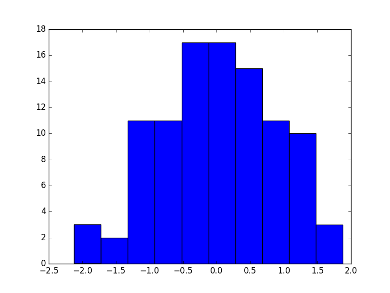
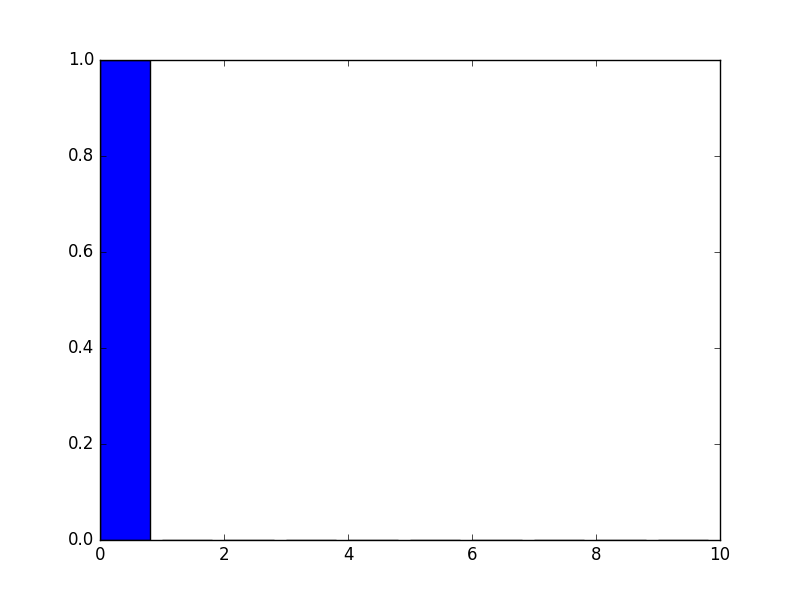

*****
Fully Unsupervised Classification with Advesarial Auto Encoders
*****

General Concept
-----

In the concept described in [1], AAE can be submitted to semi-supervised learning, training them to predict the correct label using their latent feature representation, and based on a semi-supervised training set.

Training the the network in a fully unsupervised manner requires deeper analysis and handling.

In order to create a better disentanglement in the AAE’s latent space the following methods were tested:

1. **Cyclic mode loss**
The use of a cyclic mode loss (Figure 1) - that will measure the mutual information between the latent space after the Encoder and the one after another cycle of Decode-Encoder.
Minimizing this loss should push the Encoder and Decoder to use the latent space in a consistent fashion.
The cyclic loss is implemented in a similar idea to the one suggested in InfoGAN[2].
2. **L2 regularization on latent z**
Limiting the use of the z part of the latent space using L2 loss regularization over z.
Minimizing this loss can assist in pushing more information into the y part when possible, and possibly allow better disentanglement in the latent space.ֿ
3. **Mode reconstruction loss**
Integrating another Decoder (Figure 2) called the Mode-Decoder into the training process, which is trained to learn the “mode” of the image, therefore forcing the Encoder to use the y latent space in a meaningful way.
4. **reversed pairwise mode loss**
To try and improve the style-label mixture inside the generated clusters another method was attempted and it was to integrate reversed pairwise mode loss (Figure 15) - that will push the Decoder to create “modes” which are as far apart from one another as possible.

**The general schema for semi-supervised learning can be seen here:**

.. image:: _static/semi_supervised_schema.png

Unsupervised classification accuracy metric
-----

Before diving into the unsupervised setting, a metric of accuracy performance needs to be agreed upon.
In the fully unsupervised scenario the model has no input on the real “cultural” labels stored in the validation set.  Meaning it can be a perfect classifier, and label all “0” digits together, all “1” digits together and so on, but label each group under the “wrong” cultural label (for example labeling all “0” digits under the label “8”).

Inspired by a metric commonly used for clustering accuracy, the chosen metric used in the following parts of this paper will be referred to as unsupervised classification accuracy.

The metric was measured after the training of an AAE model (and during for debugging purposes only) and it follows the following logic - 
The trained model was used to predict the labels of the entire validation set.
Each possible output label of the AAE was assigned a true MNIST label using the highest appearing MNIST label classified under this output label.
Accuracy is determined by counting the percentage [%] of validation samples that are classified in an output label that was assigned to their true MNIST label.

For example, let’s say the AAE is built using 10 possible output labels (the latent y is of size 10), and under label “3” (post-training) a 1000 samples (out of the 10K validation set samples) were classified, and 75% of those samples where the MNIST digit “4” and 25% the MNIST digit “6”.
Then the output label “3” will be assigned to the best matching MNIST label - “4”, and all the “6” digits classified under it will be considered a misclassification. 

Latent space disentangelment
-----

The training process is divided into three major parts:

1. **Auto Encoding (reconstruction)** where the Encoder-Decoder networks (Q, P) learns to encode and reconstruct the image.
2. **Adversarial** where the encoder learns how to produce latent features y which are categorical and z which are normally distirbuted.
3. **Semi-supervised** where the encoder learns to predict the right label for a pre-known labeled image.

The success of the training process can be measured based on two grounds:

**Validation accuracy** on a held out labeled validation set.
The results of the semi-supervised model reached **97% accuracy**, which shows good performance and that the model learns the labeled part properly.

.. image:: _static/semi_supervised_samples_from_all_lables.png

*each column representing a predicted label for the original displayed images, showing the high accuracy of the model*
  
**Visual reconstruction** 
Here we can see from visual examples that the reconstruction of an image (using the encoding-decoding pipeline) works pretty well. The reconstructed image is slightly blurry, which might be corrected with a slightly different loss function.

.. image:: _static/semi_supervised_reconstruction_1.png

*an example reconstruction of an original "0" digit image*

In order to analyise the success of the adversarial part (which is focused on the latent features) we can examine the learning curve, showing the loss of the generator, and descriminator networks:

.. image:: _static/semi_supervised_advesarial_learning_curve.png

*the adversarial learning curve, showing the balance which is created between generator and discriminators*

The Latent Features
-----

The adverserial training pushes the latent features to the desired distribution. The latent y part learns to behave similarly to a categorial distribution, whlie the latent z part learns to distribute as a zero-centered normal.

First, we can see that the latent features were trained properly, using the adversarial balance.

*the empricial distribution of the first dimension in the latent z vector, showing that the learned feature is indeed normally distributed around zero.*

*an empricial example of the value of the latent y vector, showing that the learned feature is indeed categorial, showing close to "1" only near the predicted label.*

Next we would like to find out if the latent features really perform as expected.
The latent y vector is trained to learn the label, or "mode" of the input. We want it to describe the actual digit inside the input, and the semi-supervised procedure helps us reach that target.

The latent z vector is expected to represent "style", and capture the deeper style of writing of a specific input digit.
Again, this happens only thanks to the semi-supervision of known labels, pushing the latent y to capture what is neccesary to describe the type of digit.

Here's a simple visualization of the meaning of the latent features:

.. image:: _static/semi_supervised_latent_features.png

*each row represents a specific latent y value (out of the categorial distribution), and along that row the first dimension of the latent z vector is sampled uniformly from the normal distribution.
One can see that indeed, the latent y completely catches the label, while the latent z controls the style and shape of the digit.*

*[1] A.Makhzani,  J.Shlens, N.Jaitly, I.Goodfellow, B.Frey: Adversarial Autoencoders, 2016, arXiv:1511.05644v2*
*[2] X.Chen, Y.Duan, R.Houthooft, J.Schulman, I.Sutskever, P.Abbeel: InfoGAN: Interpretable Representation Learning by Information Maximizing Generative Adversarial Nets, 2016, arXiv:1606.03657v1*
